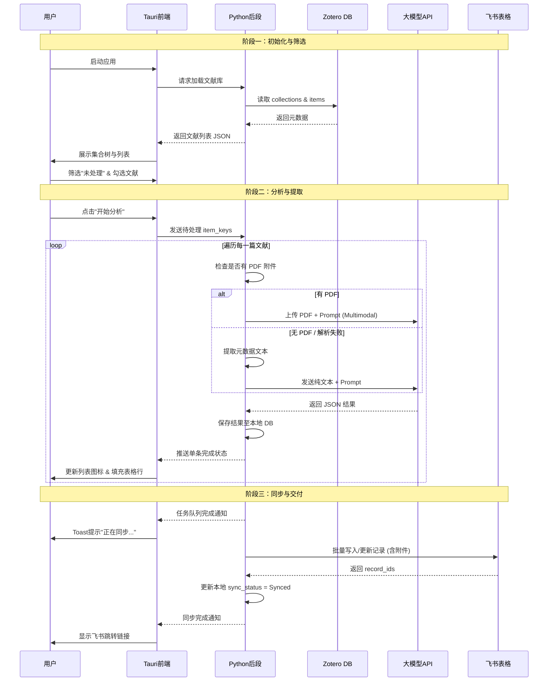

# MatrixIt 产品需求文档 (PRD)

> **版本**: 1.0  
> **状态**: 待评审  
> **最后更新**: 2026-01-21

---

## 1. 产品概述

### 1.1 背景与问题
科研人员在进行文献综述时，面临着繁琐的"文献矩阵"构建过程：需要从 Zotero 中手动整理元数据，反复阅读 PDF 提取关键信息（如研究方法、结论、局限性），并将这些信息填入 Excel 或飞书多维表格。这一过程耗时费力，且难以保持格式统一。
现有的 `backend`（原 `literature_extraction`）脚本验证了自动化流程的可行性，MatrixIt 旨在将其封装为一个美观、易用的桌面应用程序。

### 1.2 产品目标
打造一款 **"Zotero 到 飞书多维表格"** 的自动化文献矩阵生成工具。
- **自动化**：一键提取元数据 + AI 智能阅读提取 + 自动同步飞书。
- **可视化**：提供直观的文献选择和处理界面，所见即所得。
- **灵活配置**：支持用户自定义提取字段和 Prompt 规则。

### 1.3 成功指标
| 指标 | 目标值 | 衡量方式 |
|-----|-------|---------|
| 处理效率 | < 30秒/篇 | 平均单篇文献从解析到上传的耗时（不含大模型网络延迟） |
| 准确率 | > 90% | 自动提取的结构化字段无需用户二次修改的比例 |
| 易用性 | 0 配置错误 | 用户完成首次配置（API Key等）的成功率 |

---

## 2. 目标用户

| 维度 | 描述 |
|-----|-----|
| **核心群体** | 高校学生、科研人员（个人用户） |
| **核心需求** | 高效处理大量文献（Batch Processing），建立结构化的文献知识库。 |
| **使用场景** | 文献综述（Review）写作、课题组组会汇报准备、新领域快速扫盲。 |

---

## 3. 功能需求

### 3.1 功能架构图
产品主要包含三大模块：**设置配置**、**文献源管理 (Zotero)**、**矩阵分析与同步 (Matrix & Feishu)**。

### 3.2 功能清单 (按优先级 P0-P2)

| 模块 | 功能点 | 描述 | 优先级 |
|---|---|---|---|
| **配置** | 基础设置 | 配置 Zotero 数据路径、飞书参数（AppID, Secret, Bitable URL）、LLM API Key | P0 |
| | 字段定义 | 可视化编辑提取字段（名称、类型、提取指令），支持导入/导出 JSON 配置 | P0 |
| | **Prompt设置** | **提示词编辑**：支持用户查看和修改 Agent 的系统提示词 (System Prompt)。内置“评审专家”默认模板。 | P1 |
| **输入** | Zotero 同步 | 读取本地 Zotero SQLite 数据库，展示分类树和文献列表 | P0 |
| | 文献筛选 | **增强筛选**：支持按“全部”、“未处理”、“已处理”过滤。支持多选/全选/反选。 | P0 |
| **处理** | 智能提取 | 调用 LLM 分析 PDF 内容，提取指定字段信息 (Multi-modal/Text Fallback) | P0 |
| | **一键分析** | 勾选多篇文献 -> 点击“开始分析” -> 自动进入队列处理 -> 实时保存至本地数据库 | P0 |
| **输出** | 本地管理 | 提取结果优先保存在本地 SQLite/JSON，支持本地实时编辑。 | P0 |
| | **自动同步** | 分析任务结束后，自动触发同步逻辑，将本地数据（元数据+分析结果+PDF）上传至飞书多维表格。 | P0 |

### 3.3 核心功能详述

#### 3.3.1 字段自定义与 AI 分析
- **默认模板**：内置标准文献矩阵模板（包含 TLDR、研究问题、方法论、局限性等 `fields.json` 定义字段）。
- **自定义能力**：用户可添加/删除字段，设置字段类型（字符串、多选、数字、评分等）。
- **Prompt 引擎**：
    - **系统提示词 (System Prompt)**：用户可在设置中编辑全局 Prompt。
        - **预设模板**：系统内置基于 `Literature Extraction Skill` 的默认提示词，设定 AI 为“严厉的同行评审专家”，包含“客观提取”与“专家批判”两大规则集。
    - **字段指令 (Field Instruction)**：系统根据 `fields.json` 中的字段描述自动组装具体的提取指令，注入到 Prompt 上下文中。
- **模型策略**：
    - **优先**：尝试使用支持文件上传的 Multimodal API (如 Gemini 1.5 Pro) 直接读取 PDF。
    - **兜底**：若模型不支持或 PDF 解析失败，自动回退到本地 Python 提取文本 (OCR/PyMuPDF) -> 发送纯文本给 LLM。

#### 3.3.2 Zotero 数据读取
- **直连数据库**：直接读取 `zotero.sqlite` (需处理文件锁问题，建议通过复制临时数据库文件读取)。
- **附件定位**：解析 `itemAttachments` 表，自动定位本地存储的 PDF 文件路径。

#### 3.3.3 本地表格编辑与云端同步
- **本地为本**：所有提取的数据首先持久化存储在本地（MatrixIt 本地数据库）。用户在无网状态下也可进行查看和编辑。
- **状态追踪**：系统记录每条文献的 `processed_status` (未处理/处理中/已完成/失败) 和 `sync_status` (未同步/已同步)。
- **自动同步**：
    - 触发时机：(1) “开始分析”任务队列全部执行完毕后；(2) 用户手动点击“同步”按钮。
    - 同步逻辑：读取本地已完成且未同步（或有更新）的数据 -> 调用飞书 API 写入/更新多维表格 -> 回写本地 `sync_status`。

### 3.4 业务流程图

---

## 4. UI 设计

### 4.1 页面布局
采用 **左右分栏布局**，整体风格追求 **轻快、简约、高级**。

- **配色方案**：
    - **主色调**：**Tiffany Blue** (蒂凡尼蓝 #0ABAB5) ——用于强调按钮、选中状态、进度条等，营造轻快活泼的氛围。
    - **背景色**：极简白或浅灰 (#F5F7FA)，保持界面清爽。
    - **字体**：系统默认无衬线字体 (Inter/SF Pro/Roboto)，保证清晰易读。

- **左侧边栏 (Sidebar)**：宽度固定 (250px)
    - **顶部**：**设置按钮** (⚙️ Icon)。点击后从 **屏幕左侧滑出抽屉式设置面板**。
    - **主体**：Zotero 集合树 (Collection Tree)，支持层级展开。高亮显示当前选中集合。
    - **底部**：状态栏 (显示 Zotero 库路径、连接状态)。

- **右侧主区域 (Main Content)**：
    - **顶部工具栏**：
        - **筛选器 (Segmented Control)**：`全部` | `未处理` | `已处理`
        - **操作按钮**：主按钮 `开始分析` (Tiffany Blue 实心)，次按钮 `手动同步` (Outline)。
    - **内容列表区**：
        - **列表项设计**：每行展示文献核心信息（标题、作者、年份）。
        - **状态指示**：
            - `⚪ 未处理` (灰色空心点)
            - `🔵 分析中` (Tiffany Blue 呼吸动效)
            - `🟢 已完成` (绿色实心点 + 飞书图标表示已同步)
            - `🔴 失败` (红色感叹号)
        - **表格交互**：支持行展开预览详情，或点击列头切换为“表格视图”进行密集编辑。

### 4.2 交互逻辑
1. **设置配置**：
    - 点击左上角设置 -> 左侧抽屉滑出。
    - 填写 Zotero `data_dir`。
    - 填写飞书配置：`App ID`, `App Secret`, `Bitable URL` (自动解析 table_id)。
    - 填写 LLM API Key。
    - 点击“保存” -> 抽屉收起。
2. **选择与筛选**：
    - 用户点击左侧集合。
    - 顶部筛选器切换为 `未处理` -> 列表仅显示待处理文献。
    - 勾选 Checkbox (支持 Shift 连选)。
3. **执行流程**：
    - 点击 `开始分析` -> 按钮变为 `停止`，显示总体进度条。
    - 列表项状态图标依次变更：等待 -> 分析中 -> 完成。
    - 若某条失败，不中断后续任务，标记为红色。
4. **自动同步**：
    - 队列结束后，通过 Toast 提示“分析完成，正在同步至飞书...”。
    - 同步完成后，提示“同步成功”，列表项增加飞书链接图标。

---

## 5. 技术架构建议

鉴于用户需求（美观 UI + 轻量级 + 复用现有 Python 脚本），推荐采用 **Tauri + Python Sidecar** 架构。

### 5.1 技术栈选型
| 层级 | 选型 | 理由 |
|-----|-----|-----|
| **前端 (UI)** | **Tauri (React + Vite + TailwindCSS)** | 相比 Electron 极度轻量 (安装包 < 10MB)，React 生态丰富，方便实现复杂表格和美观 UI。 |
| **后端 (Logic)** | **Python (Sidecar)** | 复用 `backend/matrixit_backend` 逻辑模块，通过 sidecar 命令（`load_library/analyze/sync_feishu/update_item`）对外提供能力。 |
| **通信** | **Tauri Command / Stdout** | Rust 主进程通过 `Command` 模块调用 Python 可执行文件，通过标准输入输出交换 JSON 数据。 |
| **打包** | **PyInstaller** | 将 Python 环境和脚本打包为单文件可执行程序，随 Tauri 应用分发，用户无需安装 Python 环境。 |

### 5.2 数据流设计
1. **读取**：Frontend -> Rust -> Invoke Sidecar (`load_library`) -> Read SQLite -> Return JSON -> Frontend Render.
2. **分析**：Frontend (Select Items) -> Rust -> Invoke Python Script (LLM Logic) -> Stream Progress -> Frontend Update.
3. **同步**：Frontend -> Rust -> Invoke Sidecar (`sync_feishu`) -> Upload to Feishu.

---

## 6. 非功能需求

1. **性能**：
    - Zotero 数据库读取需在 3秒内完成（测试库规模 < 5000 条）。
    - 列表滚动流畅，支持虚拟滚动 (Virtual Scrolling) 以应对长列表。
2. **安全性**：
    - 所有 API Key 仅存储在用户本地 (OS Keylogger 或加密配置文件)，不上传云端。
    - 读取 Zotero 数据库时使用 `Read-Only` 模式或临时副本，严禁损坏用户原数据。
3. **错误处理**：
    - PDF 读取失败（加密/损坏）需有明确提示，不阻断整个队列。
    - 网络请求失败需支持自动重试 (Retry)。

---

## 7. 风险与对策
| 风险 | 对策 |
|-----|-----|
| Python 打包体积大 | 使用嵌入式 Python 或裁剪版环境；PyInstaller 排除无关库。 |
| 飞书 API 频控 | 实现请求队列 (Queue) 和速率限制 (Rate Limiter)，避免触发封禁。 |
| Zotero 数据库锁定 | 始终复制一份 `.sqlite` 到临时目录进行读取操作。 |
